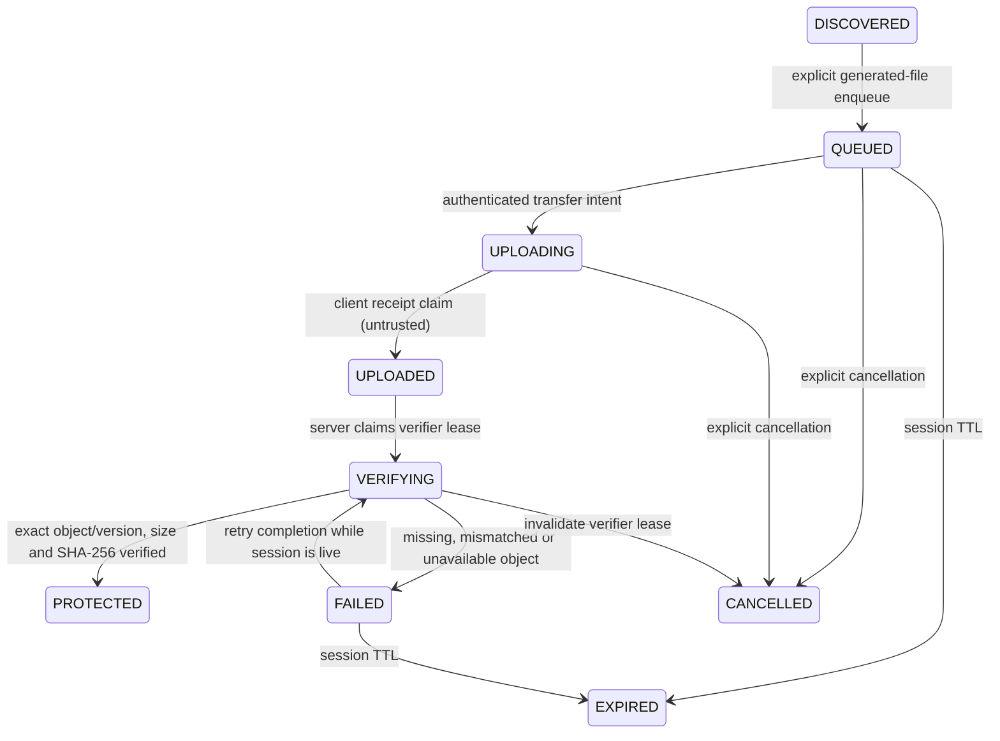

# ACL-004 verified upload lifecycle

**UPLOADED does not mean PROTECTED.** Protection is granted only by server-side
object existence, exact-size, SHA-256 and immutable-version verification. There
is no client-provided protection flag or public database status mutation.
This is the small generated-file foundation; ACL-005 is not implemented.

DISCOVERED belongs to the local planning stage; the server creates an asset in
QUEUED only on an authenticated explicit upload request. No PhotoKit asset is
automatically enqueued. `/start` records intent, not measured progress. Direct
PUT does not notify the API itself. A completion claim records UPLOADED in the
audit and immediately moves to VERIFYING in the same transaction. Consequently
UPLOADED is normally transient in server reads. All byte progress is client-side.

| State | Meaning and allowed behavior |
| --- | --- |
| QUEUED | Reservation and immutable expected metadata persisted; scoped authorization issued. |
| UPLOADING | Transfer intent recorded; bytes may not exist yet. No protection/download. |
| UPLOADED | Client claims transmission finished. No protection/download. |
| VERIFYING | Server verifier lease active; duplicates return current state rather than start another verifier. |
| PROTECTED | Successful verification recorded, quota atomically moved to protected bytes, version pinned. Authorized download only; cancellation cannot delete it. |
| FAILED | Sanitized verification failure; no protection. Reservation held through TTL. Missing/transient failures can retry completion; wrong bytes already at a create-only key require an explicitly new upload rather than overwrite. |
| CANCELLED | Explicit cancellation; no automatic object deletion. Lease invalidated and reservation held until outstanding PUT expiry. |
| EXPIRED | Session cannot protect. Reservation released once when an upload mutation reconciles expired sessions; object cleanup is separate. |

## APIs and retry rules

All routes require the existing bearer session guard. IDs are random UUIDv4.
Every mutation rechecks user/session/device revocation under the same user-first
lock order as authentication. Wrong-owner IDs return 404 with generic messages.

| Endpoint | Contract |
| --- | --- |
| POST /uploads | Header `Idempotency-Key: <UUIDv4>`. Body: media_type=image/video/test, positive expected_size_bytes ≤5 MiB, checksum_sha256 lowercase 64-hex, optional owned active device_id. Returns session/asset IDs, expiry/state and PUT URL/required headers; terminal/active-verifying retries return null authorization. |
| GET /uploads/:id | Own session state/expiry and safe error code, without provider key or credentials. |
| POST /uploads/:id/start | Idempotent transfer intent: QUEUED/FAILED → UPLOADING. Cannot set arbitrary state. |
| POST /uploads/:id/complete | Empty body. Synchronously verifies up to 5 MiB; returns safe session state. Concurrent live verifier returns VERIFYING. Validation failure returns 200 with FAILED/errorCode so callers inspect the state; it does not claim success. |
| DELETE /uploads/:id | Explicit idempotent cancellation, never media deletion. PROTECTED cancellation rejected. |
| GET /assets/:id | Only id, mediaType, status, sizeBytes. Size is null until verified. |
| POST /assets/:id/download | Own PROTECTED asset only; short-lived GET authorization for the verified version. |

Error codes include OBJECT_MISSING, SIZE_MISMATCH, CHECKSUM_MISMATCH,
STORAGE_UNAVAILABLE, IMMUTABILITY_UNAVAILABLE and UPLOAD_EXPIRED. Provider
exceptions, SQL, bucket keys, passwords and signed URLs are never logged by these
handlers. GET /health remains the foundation API/database reachability check;
it does not certify object storage readiness or asset protection.

Creation key uniqueness is `(user_id,idempotency_key)`, with a fingerprint of
media type, expected size, SHA-256 and device. Same key/same metadata returns
the same row/key/reservation; changed metadata returns 409. Retries never extend
the original session deadline. The signed TTL is floored to remaining session
time and capped at 300 seconds. Once a valid PUT has succeeded, If-None-Match:*
rejects replay. A timeout may mean storage received all bytes: completion should
be retried **before** retransmitting. The native coordinator follows that rule.

Verifier work occurs outside SQL locks. A 60-second lease/attempt UUID is checked
again before finalization; cancelled, expired, revoked or superseded work cannot
commit protection. A crashed/expired lease can be reclaimed. Verification audit
and protected metadata/quota move commit together. Duplicate completion after
protection performs no second verification or quota move.

## Identity and persistence

Additive migration `003_verified_uploads.sql` creates development_entitlements,
assets, upload_sessions, asset_verifications and upload_audit_events. Required
expected size/digest are deliberately non-null for this integrity policy. No
filenames are accepted/stored. Device IDs reference existing account-owned devices.
Server asset UUIDs and opaque object keys are independent of PhotoKit local IDs.
The object version and verification digest are private server fields.

The native UploadFoundation package stores a bounded queue of at most 32 explicit
generated-file records, stable create idempotency key, generated sandbox URL,
expected size/digest, session/asset IDs, phase and pending cancellation. It never
persists bearers, signed URLs, cloud object keys or copies of PhotoKit originals.
The generated-fixture directory is explicit, resolved path must stay within it,
and source digest is rechecked before transfer. Local JSON writes are atomic,
backup-excluded and intended to use complete iOS Data Protection. These native
behaviors have not been compiled/tested on this Windows machine.

## Interrupted transfer and future boundary

Single-part PUT is restricted to **≤5 MiB generated/development files**. A partial
HTTP transfer must not create a protectable object; the real interruption test
aborts after 128/4096 bytes and verifies missing-object failure before a whole-file
retry succeeds. This is whole-file retry, not byte-range resume or multipart.
Transient authorization data is reacquired with the same creation key. Cancellation
cancels the native async transfer and records a durable remote-cancellation intent;
a lost create response is reconciled by the stable key on a later run.

UploadTransport/UploadSessionClient/UploadStateStore/UploadCoordinator separate
transport, API authority, durable state and coordination. ACL-005 can introduce
multipart part receipts and resumable state under a new specification. There
is no large-video, background entire-library or automatic PhotoKit backup claim.

**Physical iPhone PhotoKit upload integration remains UNVALIDATED.** The user
reported prior Mac discovery build/tests and simulator success; that does not
validate this new native upload package or physical-device transfers. Complete
the physical-device gate before any beta involving customer media.
